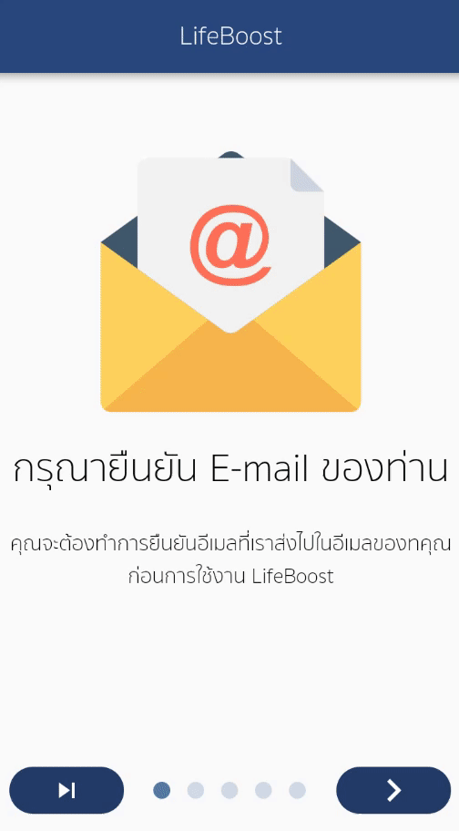

# Boost life

A new Flutter project @ITKMITL Year 2 (IT-SE)

## Feature List 
<!--  -->

  

## การคำนวณแคลอรี่
-*เราจะทำการเก็บแคลอรี่ในแต่ละวันที่มาจากการรับประทานอาหารและออกกำลังกายของคุณ*

<!--  -->

  

## การออกกำลังกาย
-*เราจะบันทึกกิจกรรมการออกกำลังกายเพื่อลดจำนวนแคลอรี่จากอาหารที่คุณรับประทานไป*
<!--  -->

  

## ร้านอาหาร
-*เราจะแนะนำร้านอาหารที่อยู่ใกล้คุณ เพื่อที่คุณจะสามารถทราบที่อยู่และรายละเอียดของร้านอาหารที่สนใจได้*
<!--  -->

  

## แผนที่ร้านอาหาร  (Out of Order, already Change Access tokens)
-*เราจะแสดงแผนที่ของร้านอาหารที่คุณสนใจ*
<!--  -->

  

## Problem with location
    When you run a mobile application on desktop simulator, which doesn't have GPS in it, you will get some fixed location every time. To get real GPS coordinates you need to install it in a android device and test it.
- [Reference](https://stackoverflow.com/questions/9778251/gps-wrong-location)
